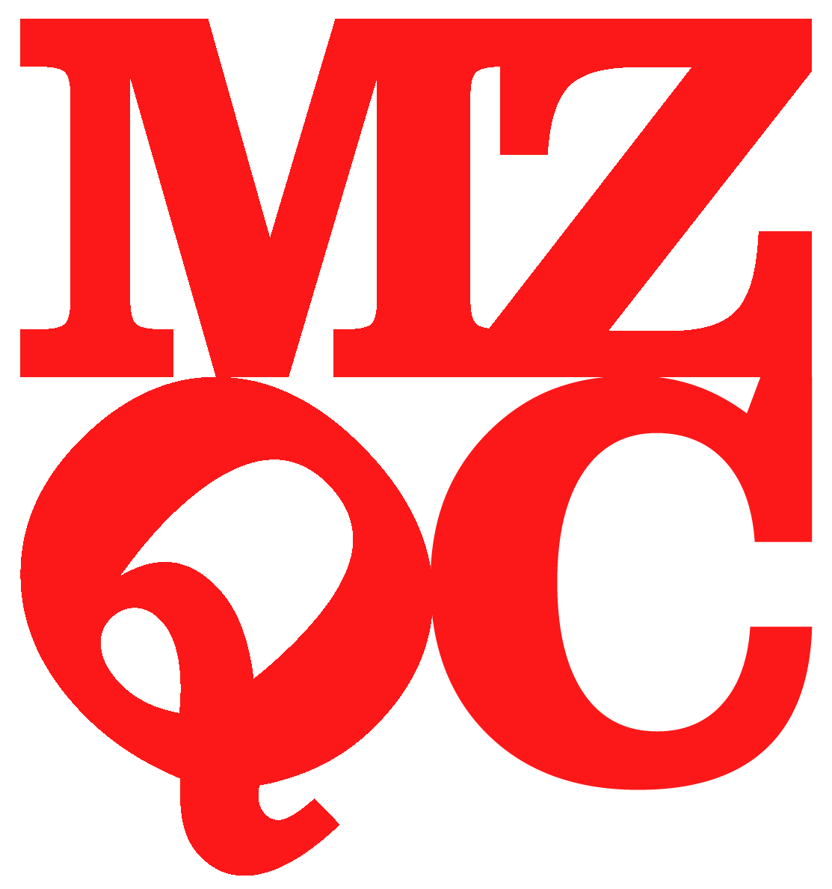

# mzQC: A standard file format for mass spectrometry quality control data

## The HUPO-PSI Quality Control working group

The HUPO PSI Quality Control working group is composed of academic, government, and industry researchers, software developers, journal representatives, and instrument manufacturers. The main goal of the QC working group is to define a community data format and associated controlled vocabulary terms, facilitating data exchange and archiving of mass spectrometry derived quality control metrics.

Current projects of the QC working group are:

- mzQC: A standard file format for the exchange, transmission, and archiving of quality control metrics derived from biological mass spectrometry.
- QC-CV: A controlled vocabulary to represent terms for the definition of quality metrics and related supporting values.

## Contribute

The easiest way to contribute is by filing an issue via GitHub.
