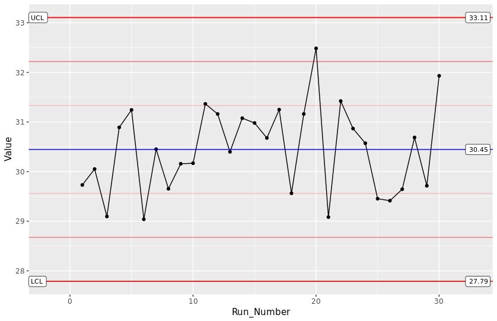

## QC Sample-Run Example of mzQC
Here, we describe details of a mzQC JSON document used for a QC sample mass spectrometry run. 
For description of the general structure of mzQC, see the Single-Run Example of mzQC.
Find the complete file at the bottom of this document or in the example folder.
The mzQC file is made from the acquision of a QC2 sample as described in [QCloud: A cloud-based quality control system for mass spectrometry-based proteomics laboratories](https://doi.org/10.1371/journal.pone.0189209). 
Optional (detailed) descriptions about the file can be placed into mzQC next to the general information about the file.
```
    "description": "This is an example of an mzQC file produced from a proteomics QC2 sample. 20 ug dried Pierce HeLa protein digest standard from Thermo Fisher Scientific (Part number: 88329) are dissolved in 200 uL of 0.1% formic acid in water to a final concentration of 100 ng/uL. A total amount of 1 uL (100ng) is injected per analysis.",
```
The metrics describe simple values like the cornerstone numbers of the acquisition and identification process, but also information specific to the QC method employed. Here, it is the mass accuracies and MS1 feature areas of selected peptides. With regular runs like this, the instrument's performance can be reliably monitored and maintenance interventions scheduled before valuable samples are wasted on an instrument running at sub-par performance. 
```
          {
            "accession": "QC:4000244",
            "name": "QC2 sample mass accuracies",
            "value": {
              "Peptide sequences": ["YAEAVTR","STLTDSLVC(Carbamidomethyl)K","SLADELALVDVLEDK","NPDDITNEEYGEFYK","LAVDEEENADNNTK","FEELNMDLFR","EAALSTALSEK","DDVAQTDLLQIDPNFGSK","RFPGYDSESK","EATTEFSVDAR","EQFLDGDGWTSR","TPAQFDADELR","LGDLYEEEMR","EVSTYIK","FAFQAEVNR"],
              "Observed mass accuracies": [-0.2346854518740762,-0.08024023890884578,-0.1322012562867409,-0.2259441806378488,-0.10596535779273217,0.28345130855013684,-0.08600783742175504,-0.3683484942567654,-0.03348194493295555,-0.41789282666789496,-0.12794363836212685,0.0,0.0,0.0,0.0]
            }
	  },
          {
            "accession": "QC:4000242",
            "name": "QC2 sample MS1 feature areas",
            "value": {
              "Peptide sequences": ["YAEAVTR","STLTDSLVC(Carbamidomethyl)K","SLADELALVDVLEDK","NPDDITNEEYGEFYK","LAVDEEENADNNTK","FEELNMDLFR","EAALSTALSEK","DDVAQTDLLQIDPNFGSK","RFPGYDSESK","EATTEFSVDAR","EQFLDGDGWTSR","TPAQFDADELR","LGDLYEEEMR","EVSTYIK","FAFQAEVNR"],
              "Observed MS1 feature areas": [1234940000.0,922790000.0,80819100.0,478714000.0,254935000.0,52841200.0,243597000.0,24581800.0,707504000.0,129063000.0,205583000.0,0.0,0.0,0.0,0.0]
            }
          },
```
The individual peptides' values are stored in a table, that is defined by the respective metric cv term. In case of the feature areas, there is a column indicating the peptide and another column for the respective feature area. 
```
[Term]
id: QC:4000242
name: QC2 sample MS1 feature areas
def: "Observed MS1 feature area from selected peptides of a QC2 sample measurement within 5 ppm and +/- 240 s RT tolerance. Selected peptides in the first column to be expected: 'YAEAVTR','STLTDSLVC(Carbamidomethyl)K','SLADELALVDVLEDK','NPDDITNEEYGEFYK','LAVDEEENADNNTK','FEELNMDLFR','EAALSTALSEK','DDVAQTDLLQIDPNFGSK','RFPGYDSESK','EATTEFSVDAR','EQFLDGDGWTSR','TPAQFDADELR','LGDLYEEEMR','EVSTYIK','FAFQAEVNR'" [PSI:QC]
is_a: QC:4000001 ! QC metric
is_a: QC:4000009 ! ID based
is_a: QC:4000006 ! table
property_value: has_column: QC:4000116 ! Peptide sequence
property_value: has_column: QC:4000241 ! Observed MS1 feature areas
```
Since each column is in turn defined by a cv term, the column can also be assigned an expected value type and unit. In this case the feature area column is expected to contain values of `MS:1001844 - MS1 feature area`s. This concept allows for easier automated metric consumption and even generic plotting of graphs. With a collection consecutive QC2 sample mzQC files, a plot like a Levey-Jennings Control Chart are easily achieved.




### This is the mzQC file once again, in full:
```
{ "mzQC": {
    "creationDate": "2020-12-03T19:51:02",
    "version": "1.0.0",
    "contactName": "Mathias Walzer", 
    "contactAddress": "walzer@ebi.ac.uk", 
    "description": "This is an example of an mzQC file produced from a proteomics QC2 sample. 20 ug dried Pierce HeLa protein digest standard from Thermo Fisher Scientific (Part number: 88329) are dissolved in 200 uL of 0.1% formic acid in water to a final concentration of 100 ng/uL. A total amount of 1 uL (100ng) is injected per analysis.",
    "runQualities": [
      {
        "metadata": {
          "inputFiles": [
            {
              "location": "/tmp/QC2_18052020.mzML",
              "name": "QC type 2 sample",
              "fileFormat": {
                "accession": "MS:1000584",
                "name": "mzML format"
              },
              "fileProperties": [
                {
                  "accession": "MS:1000747",
                  "name": "completion time",
                  "value": "2020-05-18 09:20:48"
                },
                {
                  "accession": "MS:1000569",
                  "name": "SHA-1",
                  "value": "fbe692c887404179518089abc670484c"
                },
                {
                  "accession": "MS:1000031",
                  "name": "instrument model",
                  "value": "LTQ Orbitrap Velos"
                }
              ]
            }
          ],
          "analysisSoftware": [
            {
              "accession": "MS:1001058",
              "name": "quality estimation by manual validation",
              "version": "0",
              "uri": "https://dx.doi.org/10.1021/pr201071t"
            },
            {
              "accession": "QC:0000000",
              "name": "QCCaclulator",
              "version": "0.9.0",
              "uri": "qccalculator.readthedocs.io"
            }
          ]
        },
        "qualityMetrics": [
          {
            "accession": "QC:4000060",
            "name": "Number of MS2 spectra",
            "value": 62299
          },
          {
            "accession": "QC:4000186",
            "name": "Total number of PSM",
            "value": 24765
          },
          {
            "accession": "QC:4000187",
            "name": "Number of identified peptides",
            "value": 22241
          },
          {
            "accession": "QC:4000185",
            "name": "Number of identified proteins",
            "value": "5504"
          },
          {
            "accession": "QC:4000244",
            "name": "QC2 sample mass accuracies",
            "value": {
              "Peptide sequences": ["YAEAVTR","STLTDSLVC(Carbamidomethyl)K","SLADELALVDVLEDK","NPDDITNEEYGEFYK","LAVDEEENADNNTK","FEELNMDLFR","EAALSTALSEK","DDVAQTDLLQIDPNFGSK","RFPGYDSESK","EATTEFSVDAR","EQFLDGDGWTSR","TPAQFDADELR","LGDLYEEEMR","EVSTYIK","FAFQAEVNR"],
              "Observed mass accuracies": [-0.2346854518740762,-0.08024023890884578,-0.1322012562867409,-0.2259441806378488,-0.10596535779273217,0.28345130855013684,-0.08600783742175504,-0.3683484942567654,-0.03348194493295555,-0.41789282666789496,-0.12794363836212685,0.0,0.0,0.0,0.0]
            }
	  },
          {
            "accession": "QC:4000242",
            "name": "QC2 sample MS1 feature areas",
            "value": {
              "Peptide sequences": ["YAEAVTR","STLTDSLVC(Carbamidomethyl)K","SLADELALVDVLEDK","NPDDITNEEYGEFYK","LAVDEEENADNNTK","FEELNMDLFR","EAALSTALSEK","DDVAQTDLLQIDPNFGSK","RFPGYDSESK","EATTEFSVDAR","EQFLDGDGWTSR","TPAQFDADELR","LGDLYEEEMR","EVSTYIK","FAFQAEVNR"],
              "Observed MS1 feature areas": [1234940000.0,922790000.0,80819100.0,478714000.0,254935000.0,52841200.0,243597000.0,24581800.0,707504000.0,129063000.0,205583000.0,0.0,0.0,0.0,0.0]
            }
          },
        ]
      }
    ],
    "controlledVocabularies": [
      {
        "name": "Proteomics Standards Initiative Quality Control Ontology",
        "uri": "https://github.com/HUPO-PSI/qcML-development/blob/master/cv/v0_1_0/qc-cv.obo",
        "version": "0.1.1"
      },
      {
        "name": "Proteomics Standards Initiative Mass Spectrometry Ontology",
        "uri": "https://github.com/HUPO-PSI/psi-ms-CV/blob/master/psi-ms.obo",
        "version": "4.1.7"
      }
    ]
  }
}
```