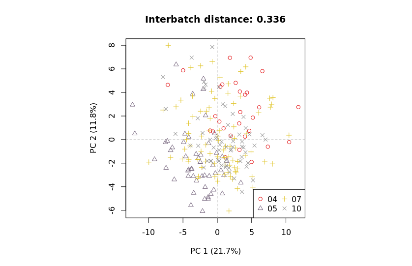
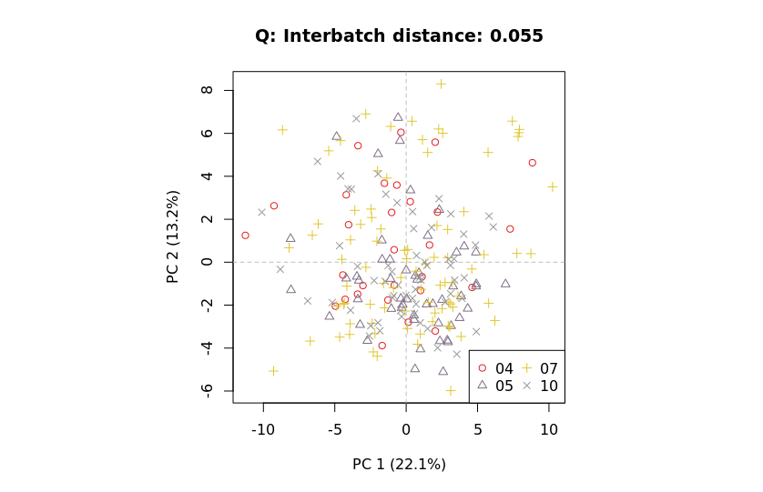

## Metabolomics batch runs example

Here, we describe details of a metabolomics mzQC JSON document used to describe a Studies' quality before and after batch correction methods are applied. 
For description of the general structure of mzQC, see the Single-Run Example of mzQC.
Find the complete file at the bottom of this document or in the example folder.
The mzQC file is made from the acquisions of GC-ToF-MS polar metabolite data of an Arabidopsis nucleotype-plasmotype diallel study as described in [Improved batch correction in untargeted MS-based metabolomics](https://dx.doi.org/10.1007%2Fs11306-016-1015-8). 

```
    "description": "This dataset is based on the analysis of polar extracts from a nucleotype-plasmotype combination study of Arabidopsis for 58 different genotypes. For details of the used plant material we refer to Flood (2015). Analysis of the polar, derivatized metabolites by GC-ToF-MS (Agilent 6890 GC coupled to a Leco Pegasus III MS) and processing of the data were done as described in Villafort Carvalho et al. (2015). Here, the number of metabolites (75) is much lower than in the other two data sets, partly because the focus was on the primary rather than the secondary metabolites. The number of samples was 240, with a percentage of non-detects of 16 %; the maximum fraction of non-detects in individual metabolites is 92 %. All metabolites were retained in the analysis. Four batches of 31-89 samples were employed, containing 2-6 QCs per batch, 14 in total."
```
This example has, as the `description` eludes to, 240 runs, for which each a `qualityMetric` object is present in `qualityMetrics`, for sake of brevity only containing the number of successfully detected metabolites.
```
      { 
        "metadata": {
          "inputFiles": [
            {
              "location": "/tmp/GCMS-ToF-sample-10.mzML",
              "name": "GCMS ToF sample 10",
              "fileFormat": {
                "accession": "MS:1000584",
                "name": "mzML format"
              },
              "fileProperties": [
                {
                  "accession": "MS:1000031",
                  "name": "instrument model",
                  "value": "GC-ToF-MS (Agilent 6890 GC coupled to a Leco Pegasus III MS)"
                }
              ]
            }
          ],
          "analysisSoftware": [
            {
              "accession": "MS:1001058",
              "name": "quality estimation by manual validation",
              "version": "0",
              "uri": "https://dx.doi.org/10.1021/pr201071t"
            },
            {
              "accession": "QC:0000000",
              "name": "QCCaclulator",
              "version": "0.9.0",
              "uri": "qccalculator.readthedocs.io"
            }
          ]
        },
        "qualityMetrics": [
          {
            "accession": "QC:4000257",
            "name": "Detected Compounds",
            "value": 57
          },
        ]
      },
...
```
For the purpose of batch correction, next described is the set of all runs that are batch corrected. Hence, the `setQualities` field of `inputFiles` contains all regular runs, and the related metric is a principle component analysis of the peak area features of all batches' runs.

```
        "qualityMetrics": [
          {
            "accession": "QC:4000254",
            "name": "Peak area feature PCA result",
            "value": {
              "Run name": ["GCMS ToF sample 10","GCMS ToF sample 100","GCMS ToF sample 101","GCMS ToF sample 102","GCMS ToF sample 103","GCMS ToF sample 104","GCMS ToF sample 106","GCMS ToF sample 107","GCMS ToF sample 108","GCMS ToF sample 109","GCMS ToF sample 11","GCMS ToF sample 110","GCMS ToF sample 111","GCMS ToF sample 112","GCMS ToF sample 113","GCMS ToF sample 114","GCMS ToF sample 115","GCMS ToF sample 116","GCMS ToF sample 117","GCMS ToF sample 118","GCMS ToF sample 119","GCMS ToF sample 12","GCMS ToF sample 120","GCMS ToF sample 121","GCMS ToF sample 122","GCMS ToF sample 123","GCMS ToF sample 124","GCMS ToF sample 125","GCMS ToF sample 126","GCMS ToF sample 127","GCMS ToF sample 128","GCMS ToF sample 129","GCMS ToF sample 13","GCMS ToF sample 130","GCMS ToF sample 132","GCMS ToF sample 133","GCMS ToF sample 134","GCMS ToF sample 135","GCMS ToF sample 136","GCMS ToF sample 137","GCMS ToF sample 138","GCMS ToF sample 139","GCMS ToF sample 14","GCMS ToF sample 140","GCMS ToF sample 141","GCMS ToF sample 142","GCMS ToF sample 143","GCMS ToF sample 144","GCMS ToF sample 145","GCMS ToF sample 146","GCMS ToF sample 147","GCMS ToF sample 148","GCMS ToF sample 149","GCMS ToF sample 15","GCMS ToF sample 150","GCMS ToF sample 151","GCMS ToF sample 152","GCMS ToF sample 153","GCMS ToF sample 154","GCMS ToF sample 155","GCMS ToF sample 156","GCMS ToF sample 157","GCMS ToF sample 158","GCMS ToF sample 159","GCMS ToF sample 16","GCMS ToF sample 160","GCMS ToF sample 161","GCMS ToF sample 162","GCMS ToF sample 163","GCMS ToF sample 164","GCMS ToF sample 165","GCMS ToF sample 166","GCMS ToF sample 167","GCMS ToF sample 168","GCMS ToF sample 169","GCMS ToF sample 17","GCMS ToF sample 170","GCMS ToF sample 171","GCMS ToF sample 172","GCMS ToF sample 173","GCMS ToF sample 177","GCMS ToF sample 178","GCMS ToF sample 179","GCMS ToF sample 18","GCMS ToF sample 180","GCMS ToF sample 181","GCMS ToF sample 182","GCMS ToF sample 183","GCMS ToF sample 184","GCMS ToF sample 185","GCMS ToF sample 186","GCMS ToF sample 187","GCMS ToF sample 188","GCMS ToF sample 189","GCMS ToF sample 19","GCMS ToF sample 190","GCMS ToF sample 191","GCMS ToF sample 192","GCMS ToF sample 193","GCMS ToF sample 195","GCMS ToF sample 196","GCMS ToF sample 197","GCMS ToF sample 198","GCMS ToF sample 199","GCMS ToF sample 2","GCMS ToF sample 20","GCMS ToF sample 200","GCMS ToF sample 201","GCMS ToF sample 202","GCMS ToF sample 203","GCMS ToF sample 204","GCMS ToF sample 205","GCMS ToF sample 206","GCMS ToF sample 207","GCMS ToF sample 208","GCMS ToF sample 209","GCMS ToF sample 21","GCMS ToF sample 210","GCMS ToF sample 211","GCMS ToF sample 212","GCMS ToF sample 213","GCMS ToF sample 214","GCMS ToF sample 216","GCMS ToF sample 217","GCMS ToF sample 218","GCMS ToF sample 219","GCMS ToF sample 22","GCMS ToF sample 220","GCMS ToF sample 221","GCMS ToF sample 222","GCMS ToF sample 223","GCMS ToF sample 224","GCMS ToF sample 225","GCMS ToF sample 226","GCMS ToF sample 227","GCMS ToF sample 228","GCMS ToF sample 229","GCMS ToF sample 23","GCMS ToF sample 230","GCMS ToF sample 231","GCMS ToF sample 232","GCMS ToF sample 233","GCMS ToF sample 234","GCMS ToF sample 235","GCMS ToF sample 236","GCMS ToF sample 238","GCMS ToF sample 239","GCMS ToF sample 24","GCMS ToF sample 25","GCMS ToF sample 26","GCMS ToF sample 27","GCMS ToF sample 28","GCMS ToF sample 29","GCMS ToF sample 3","GCMS ToF sample 30","GCMS ToF sample 32","GCMS ToF sample 33","GCMS ToF sample 34","GCMS ToF sample 35","GCMS ToF sample 36","GCMS ToF sample 37","GCMS ToF sample 38","GCMS ToF sample 39","GCMS ToF sample 4","GCMS ToF sample 40","GCMS ToF sample 41","GCMS ToF sample 42","GCMS ToF sample 43","GCMS ToF sample 44","GCMS ToF sample 45","GCMS ToF sample 46","GCMS ToF sample 47","GCMS ToF sample 48","GCMS ToF sample 49","GCMS ToF sample 5","GCMS ToF sample 50","GCMS ToF sample 51","GCMS ToF sample 52","GCMS ToF sample 53","GCMS ToF sample 54","GCMS ToF sample 55","GCMS ToF sample 56","GCMS ToF sample 57","GCMS ToF sample 58","GCMS ToF sample 59","GCMS ToF sample 6","GCMS ToF sample 60","GCMS ToF sample 61","GCMS ToF sample 62","GCMS ToF sample 63","GCMS ToF sample 64","GCMS ToF sample 65","GCMS ToF sample 66","GCMS ToF sample 68","GCMS ToF sample 69","GCMS ToF sample 7","GCMS ToF sample 70","GCMS ToF sample 71","GCMS ToF sample 72","GCMS ToF sample 73","GCMS ToF sample 74","GCMS ToF sample 75","GCMS ToF sample 76","GCMS ToF sample 77","GCMS ToF sample 78","GCMS ToF sample 79","GCMS ToF sample 8","GCMS ToF sample 80","GCMS ToF sample 81","GCMS ToF sample 82","GCMS ToF sample 83","GCMS ToF sample 84","GCMS ToF sample 87","GCMS ToF sample 88","GCMS ToF sample 89","GCMS ToF sample 9","GCMS ToF sample 90","GCMS ToF sample 91","GCMS ToF sample 92","GCMS ToF sample 93","GCMS ToF sample 94","GCMS ToF sample 95","GCMS ToF sample 96","GCMS ToF sample 97","GCMS ToF sample 98","GCMS ToF sample 99"],
              "PCA Dimension 1": [-3.3489633839,0.4191257477,6.8241553933,-1.0808863947,-1.707045218,2.8308541748,-2.2338635322,3.9699078343,-2.4770395336,-2.7332267846,-0.4470879071,-5.1985965443,-1.6871799846,-0.162214613,4.4931694088,1.065013029,-1.1940566219,4.1964218311,-4.9229903804,-0.0487967333,7.9232129003,0.2905566121,-2.4167956848,4.188667538,-0.2907648229,-0.9276300068,2.8475911731,-2.968729106,4.1660313629,-1.137933623,1.7420100896,4.759143556,-0.3069984724,0.3569010485,-4.0831272735,3.5694159259,2.2713740735,-5.0789607892,-0.0752693899,7.1581925537,0.828962944,-1.5693378796,-5.1842079165,0.3652225255,1.2012539074,0.7432225587,-0.0185043171,-2.9830231055,-1.0151965987,-2.6590623404,1.1782955448,5.3186313176,-10.4677770954,7.2263723602,2.3232291491,3.8652035606,6.025908917,1.5578940537,-1.8630675831,2.4299328853,2.4489501744,-8.1272401542,-6.9339250968,-2.6514879488,-10.498114593,-8.0560929327,-2.4843500653,-1.5591274019,-4.1491782662,-7.6513289916,-7.7606513161,-4.2396234647,-7.9197018596,-6.0399736461,-3.3695303241,-1.8478444188,-2.3881146016,-2.2744510576,-0.3913099263,-1.6048077914,-0.2399191721,-4.1136913613,-0.6269833457,-5.0090218488,0.5306315727,-6.592080735,-4.492378256,-1.3028620578,-3.8371703822,-5.2130536703,-5.4317236274,-0.5999563478,2.1531396916,-1.9443562481,-0.7331334459,0.951283388,2.7826978447,-2.2532581555,-0.0741762409,-7.0497329655,-4.278429051,0.0769809917,7.9025446164,-3.5982310916,-3.2004377118,-7.3783032825,-2.3113338329,-1.7110468372,-3.20605726,-3.6158552084,7.520231951,1.4600045217,-3.8326763159,6.1094439358,1.0450705098,-1.1646018992,1.0397856472,-0.2774277653,-3.6065836315,-1.776450852,1.7033047566,-1.9458179288,-0.2510462381,-2.4726347321,1.9418319684,-2.0328351118,4.9950994081,-0.8091622655,-1.2994065497,-1.5601348705,-4.1472603067,0.9442454758,-3.5628871304,-4.6960341411,0.7348968302,-3.3741246267,1.9625296323,-3.2913616085,3.9293009716,-1.205756014,2.8494074208,3.7449335931,-1.3034700542,1.8941360122,0.2289366469,-0.3611115399,-2.2606294339,-4.3259115467,-4.037708695,-0.9144311394,-4.6667650928,-4.0681783501,0.6306024972,-4.8651276138,-2.6822831119,3.5012376744,4.7247233268,2.4099708448,0.2868303919,0.6393485354,-0.5288303333,-0.9719860724,3.0923171347,-6.1153085456,7.2981571438,1.1822851458,1.3488446334,2.231647972,2.7491393016,12.0457639249,6.282702297,1.7760115076,2.1585026031,1.8310786124,-11.8407707681,3.8160350734,4.2813855441,9.1643828848,4.1860017961,6.5689740649,12.3831848323,7.481412766,1.3363157101,3.4447531681,3.849074158,-6.5830897773,4.6122127984,3.7304911054,0.1042706374,4.2398502663,4.9181056021,0.5174171321,7.5574701484,6.8105359833,4.1691413147,-1.1791599605,6.0136378152,2.0571260202,1.7062619383,3.5873517455,1.2681832303,3.0395313236,0.4216375015,2.4870567016,0.9305310838,2.0223972375,-1.9468972547,-0.7278680161,-3.4396024067,-1.3879392689,1.8532049653,-0.7323080554,-0.1044978744,3.618711788,1.0473173519,-3.234407891,5.1268898175,2.7572048852,-1.8963995901,-3.4274871811,-1.7860465161,4.2464436594,2.3680717944,1.6740603069,-2.928425603,10.0001640731],
              "PCA Dimension 2": [-2.3414347017,2.0552198422,1.5142354815,2.9945511395,6.0701613531,3.3266278572,3.3685284856,0.5399655333,2.3932072785,2.7643008047,-4.4976917552,4.0508987872,1.4660293581,0.0770429575,0.0024804836,1.1879740902,0.5707980874,-1.3918382896,1.0451142023,3.5322514915,-2.5080634204,-1.9854748977,-1.0918833604,-0.5248062282,-0.7546478724,0.8834778808,1.7014956692,2.4943035973,1.6819956954,2.164453404,1.8319649453,0.8101455665,-1.5333999507,3.1578474235,1.3427308128,-1.9448531516,2.364325228,3.1655048258,-0.2917984184,-8.0143656151,-4.1139242264,2.7958020455,-1.8695850138,-3.4957487643,-2.7126585146,-6.6259650197,1.4678688788,1.860009365,1.5306572809,2.7205793212,-0.7433254297,-3.3517992711,-0.3683510015,-4.6520979386,-0.2969785081,-6.1260045659,-2.7918429522,-2.4112026192,0.5809935688,-2.4070162921,-6.2765335862,-3.566985763,1.8899075764,0.7159550768,0.2178688987,2.0647094711,-0.1057277641,-3.9440217112,-6.1913732752,-3.5142609684,-2.7538027387,-0.4912709915,-3.004320254,-2.2817738773,-3.6949715311,-6.9558846923,-3.0744193535,1.7548977324,-5.2636295072,-4.7378502816,1.8387353375,1.0740775321,0.1835648149,1.897957498,0.679158744,-0.3750873679,1.9841123762,0.6193101644,0.660805318,3.4699798867,0.5116066126,2.190893902,-0.555333107,-0.2790107249,-4.6845409886,1.8409696954,0.530709381,-2.1822527379,1.7141617973,-0.0011017748,2.3063334903,-0.188886904,-5.3206715922,4.4367196141,-1.3754645576,0.6046279987,0.138546764,2.4113359288,-0.4279627921,0.1660507663,-2.6017667638,1.8171734659,-1.9287317332,-0.4871874161,0.0066686902,-2.8455727834,-0.7671619426,0.8987028496,0.6110709048,2.7598142193,-4.6815935268,0.9227273089,-4.4617670261,3.304331427,-4.9056616075,0.8563141357,-5.8889824839,-2.998209467,1.7242970052,-1.2480321852,-0.975974124,1.8048862439,1.4810275414,-0.4489186938,-7.8716066565,1.8305754809,2.3758996966,-4.0840381076,0.511994141,2.3561564188,-1.8099415196,-6.9678750052,2.2163383495,-4.3832101315,-0.0977442974,0.4469612911,0.6190589068,-3.9923664824,-0.2537069808,-0.9517635634,-0.745099422,-3.8174845507,-0.6870928333,-6.9698275224,-4.824004353,3.1139341738,-0.4880301904,1.3030136002,2.8688932063,2.1926134768,2.6298741845,3.025650846,1.2350628205,-2.7446679861,0.1336670141,3.1024683047,4.9055041462,3.1173516042,1.5730926887,-0.5070724258,3.4016550643,4.0467956149,6.093295473,5.0591633712,-2.7620964198,2.5247364196,2.647086586,1.6895717109,2.5580686197,0.6806439599,-2.9500776533,2.41717624,5.0418393595,4.5406613701,5.5848945381,-5.8202052908,1.4384628468,2.4950964741,1.1487093353,3.1176371508,0.2318095042,4.2757365759,0.2310854792,0.9173859454,-0.2008158459,1.5141763073,-6.3773907519,-4.2728006741,-2.0448990134,-3.88337042,0.3256674661,3.5027264787,-0.5171001085,1.9175499599,4.6431566297,-5.1688101823,-0.339153104,1.4524116058,3.679482305,1.8253918947,3.0501141436,4.596802953,2.9918774591,-3.70235352,-1.8028466468,0.8723962872,1.6521201628,3.1369325927,3.1258090201,-5.7882477799,2.182551129,1.8413552942,1.0015138509,0.4502112672,4.1755869513,1.9181471533],
              "PCA Dimension 3": [-1.486755263,-0.3965900879,1.1636677021,0.4218368225,0.6279504624,0.2787506494,0.4859709784,2.2673566673,1.3419932346,-0.6029531974,0.0264738709,0.1210826655,-0.9580036113,-0.399662916,2.3713223448,3.1825507983,2.520605116,-1.5236703016,-2.0860320842,0.1323864229,-1.6463719321,-2.4429804195,0.4138364442,1.3008876819,3.4981558052,3.6362225519,0.081043987,1.0122156378,0.3938019126,0.7976645154,0.7794141485,0.959752943,-3.7132336063,2.3439740591,-0.8625858404,1.791741973,1.5236595734,1.5675532231,0.0079893576,-1.7107311631,3.2602117215,0.7698946646,-0.4215726074,2.2741852328,2.5798029939,0.9805048612,1.3405782287,1.6911617993,1.8060535806,1.2790567434,1.6590662494,1.2181793678,-0.2107432521,-5.9904584463,1.53809143,-1.0033279918,0.4417725871,1.7128056955,2.4502353921,0.4828558561,0.8326262865,-3.981127079,-1.9137287517,-2.2263735093,-3.9891276301,0.3262778151,-2.1857826473,-1.9567649201,1.8440867941,-3.7656766736,-4.037478948,-0.7788136838,-5.185592749,0.2680087429,1.5587023154,-0.7157441253,2.3901013509,-0.8052396849,2.0517632033,-0.4879533262,0.0530671784,-0.2105810034,-2.7002555815,-3.0626289465,1.9458025121,2.4022452508,0.9823209367,-2.0473003669,-0.8742348843,-0.1641980522,2.8442381951,2.9656207537,2.3052354842,2.8976270925,-0.7858774719,-0.0558701876,1.2198338665,1.7660043305,1.4689670126,0.2245921778,1.2642989407,-0.9735745956,-1.5579074257,1.286454285,-2.3623315276,-2.3023656978,-1.3121778839,-0.1465082872,2.7256178828,-1.765974423,-1.854691044,3.0529456864,3.3335193961,-3.3877463244,2.7927366281,4.9376180282,-0.8181841267,1.1165612318,-0.7714025885,0.533058856,4.4182956069,0.7681319913,2.3109508685,-1.6220365787,3.5282605601,3.7933422228,-2.006225506,3.1132839131,1.3618508505,1.3592252,0.3596705725,1.1003876276,1.9165579279,-0.205539836,2.5552211538,3.1718394172,1.6739331117,-0.1957722062,2.3547678884,1.9239197118,3.4735203895,3.6370827256,2.1447250745,4.856972227,2.330321779,2.2757798249,4.5178460302,0.9441327504,-4.1618707061,-1.7057040598,-1.8004566642,-2.8649081728,-2.3515415373,-0.0159179495,-2.7911718195,-2.7945172431,-2.4358855025,-0.1571510545,-4.2446172948,-0.6236937584,-4.9038117532,-2.2082239264,1.6166730051,0.3292655666,-3.6341940496,0.2933969087,-0.2030728319,-1.0423704741,0.2271753944,-5.6189815651,0.8678367603,-0.7796477169,-1.8928767613,-0.9950594629,-4.1288012632,-0.2688994277,-3.3734016679,-2.1717201086,0.4155345397,-0.5107364471,-8.3031694775,-2.7128050278,-0.5877460293,-1.2300092444,-0.4631463321,-0.8985672264,-0.1057844011,2.0658145023,-1.9044567629,1.6752432249,-1.9487552566,-2.283720799,-0.5256638754,1.2704269883,1.0245405146,-3.4973305234,0.8234502071,2.817842756,0.9093052226,1.3638511588,3.3107204798,1.7015161138,-0.3359203872,0.2777033654,-0.1842247635,0.2343154685,-3.5565747211,-1.3677633713,0.1746341638,-1.9822911116,-0.5654405766,0.5406554403,-1.1740038798,-5.8864479253,1.4858206407,-2.276237443,1.5351798599,-1.3299021983,-2.3492399815,-5.3349571543,0.7809367436,0.6709414194,1.235160356,-0.5123827017,-0.449581606,-1.348393423],
              "PCA Dimension 4": [-0.2766203768,1.7808802633,0.1736233713,0.0138690699,-0.6287316786,-0.2886769486,-2.1754672639,-0.8820352473,-1.5557342637,-0.2442097885,-0.2540317107,-2.2939588397,1.6336153893,-1.9102123456,-1.2562109422,-2.8529809857,-1.3415328597,-1.0141819096,0.4602074967,-1.1313942722,-0.3736082111,0.6702313991,-5.2066102178,-2.216369313,-1.7784631342,-3.4200651724,-2.6621075614,-1.7063320187,-2.3851620001,-1.989957389,-1.4717258688,-1.7738746971,-0.4002628137,-3.1127883192,-0.6433369744,-3.4052156606,-3.0346732392,-2.332333378,-1.2321911808,-2.137956296,-3.3202333816,-2.2923066183,0.9441580922,-4.3340161065,-3.5957776469,-3.7459415598,-3.0837428107,-2.6012709668,-2.3125192337,-1.5021133084,-2.3768023565,-2.1086435888,-3.8668386752,-0.1607162346,-1.6938835722,-2.2322143572,-2.1251113576,-2.439061118,-1.8479459893,-2.7821292919,-2.1886461388,1.1022731571,-1.224409654,-0.2591354673,-2.3741801305,-1.6834357832,1.7403148816,2.9656921339,1.1756944192,1.8642252426,2.4558135206,0.5527130201,0.3949829861,0.764363734,1.8063277784,-2.6558298533,0.3350480027,-1.5472526781,1.2200304331,2.1502501293,0.2013914473,0.0446128905,-2.2163511715,-0.4826676842,3.3635828421,2.7893021313,1.3628919314,0.1811456416,2.5397000883,-2.7494475814,1.5011960086,-0.5186530101,2.1006829023,1.7803073747,-0.6398068751,-1.2446598297,3.0496263459,-1.4896127306,-0.0608320016,1.6431227012,0.6647613968,0.919778263,1.5596656954,-0.4105861083,-0.2108989457,-0.5647282858,1.2191495587,-0.0358405263,0.5650551566,0.4731532887,0.3196517915,-0.7448972808,1.6036461331,-0.7345159861,0.7508243028,1.6400808421,-0.0380485698,1.3164500551,1.9382638257,0.8358360539,4.0436066873,1.2189799844,2.0622353359,0.3583357985,5.3287093962,-0.0497758655,-1.0926718535,1.6865399052,2.403880588,5.3689165072,4.8689264793,2.1790882036,1.719411485,3.4278663476,3.9113103891,0.2026848412,2.8865514553,-1.2054755078,2.9986990389,2.6179489964,4.0573098117,2.4088738718,1.7383306698,6.185028542,3.6052976034,2.6810055072,2.9970703579,-1.5940529365,0.7269170791,-1.1528825656,-0.644418421,0.9163095137,1.1829633313,-3.0918546206,0.584744672,1.6520310552,0.7627244549,0.2326803026,2.9424630163,0.5854472306,2.5356643898,1.5422943809,-0.220200397,-0.3396047961,1.9788161348,0.6886351975,0.521658645,0.939633228,0.5924712314,1.5269837156,0.4775058009,-0.382558746,0.3350931701,0.0923630787,-2.8369673938,0.6990785044,0.7704581882,-0.3077553452,0.568508925,-0.9561704562,0.663821978,0.429564779,-0.3838969774,0.5893210076,-0.2539882181,-1.4676653354,-0.467939408,-0.2546326038,-1.4623508149,-0.6729554697,-0.3872129033,-0.5683832081,-0.9728904837,-0.545623443,-0.0633339111,0.7293068893,-1.1935029485,-2.4331475731,-0.9628147014,-2.1852229245,0.0954276292,-0.907545975,1.00641931,-0.0094860372,-0.5632824368,-2.0720054668,1.1997311453,1.4841864461,-0.8744412446,2.2765271257,-0.1846044509,-1.6476546693,-0.5551321564,0.8974793563,-0.6290302854,0.7035319315,1.6503138499,0.7951019004,1.6767869214,-2.5899869348,-0.0665740263,0.9382835235,-0.0915345042,2.1003243699,0.3337123246,0.2758586347],
              "PCA Dimension 5": [-2.6836316103,-2.0202377954,-3.0888055462,-3.1615028096,-1.0645121408,-0.686733902,0.1051308721,-2.3134531669,-1.1276840195,1.8919443277,-2.9226873102,0.5952255875,0.3232282117,0.7725490363,-1.8064125554,-1.4637668335,-2.0709170197,1.3225350747,1.2844101582,1.4209488835,3.7069651623,-0.4833892703,0.5180034387,-0.1330345948,-1.4784853975,-0.8807304644,1.6530240203,1.4782093821,2.197244834,2.0832185798,1.5401349816,1.6409797488,0.1029089983,0.9573769402,1.3367078548,1.1448593574,1.7747503893,1.3016871546,2.0881877878,3.6816726786,-0.2690222482,1.3271491459,-3.3130750572,1.3262078716,-0.4466047384,-0.6615233491,0.6807036833,0.9845815196,0.9393474261,2.0492333692,1.9456467956,0.2936419622,2.2550001021,-0.2801230095,1.5061875104,2.1520620744,1.8630877773,0.6260359437,0.2565193734,2.1940299386,1.1431797641,-1.7350367593,0.427214186,0.9984204184,-1.4720971465,-0.6012641273,0.4456773467,2.2815484129,-0.767266954,-0.9683302993,-1.7176716072,0.1342994312,-0.7939013687,1.1087064877,0.6836685802,-0.9657873707,-1.4284672427,1.2224541266,0.9030583042,0.8109339202,2.6171052658,2.0017429403,2.2682132521,-2.1849916838,2.4513609731,0.2912862822,2.6616245562,1.3273360604,1.9136171388,2.0250449257,0.0474925911,-0.7726885193,0.6173259359,0.926906868,-3.7568973698,3.0393061215,3.393006097,1.917486867,3.2310468001,0.9071759103,1.3964680171,1.235102502,3.0988192364,2.2933548105,-1.1522884297,0.3531654301,1.3215432284,2.9519955985,-0.021108574,1.2585524089,2.6362955886,0.3919919469,-0.0916750612,4.8119878251,0.9644206323,-0.2621033429,-3.7615748467,2.2822443376,0.0284772386,1.5799023679,-0.9046583955,0.5442315987,0.087252778,-0.1811988155,0.9822612718,-0.2593701379,-3.091153702,-0.3090633092,2.2723279914,0.9315060625,0.795611678,2.7205648778,1.3117141809,0.8205411031,1.2576570962,0.2272574844,1.7667666266,-1.5546577702,1.4668412065,1.217010192,0.8898062475,0.5441170332,1.8990889802,1.4416008705,1.8175907624,1.2138829088,-0.4948531237,-3.7852453324,-0.629978818,-1.6914183234,0.1849671722,-0.8255348305,0.3417951204,-1.8894297218,-1.1934677141,-2.8845430469,-4.9050003336,-2.7474316741,-1.6930147231,-1.9464306679,-0.7507302543,-1.0565488914,-3.5677178123,-1.8055868386,-1.3740948973,-2.7203785109,-1.68999888,-2.2914266649,-3.4133182417,1.6228278208,-1.212803682,-1.2665147761,-0.8108345822,-0.6226735532,1.3484133563,-0.1543830735,-0.7384427849,0.0727835086,-3.6127909532,-0.52484856,3.0053390042,1.248744243,0.4525774397,-0.1374732779,0.7084067136,-1.3116009746,-1.9873870587,-1.4555852939,0.6550334495,-0.8633308878,0.259757384,-0.2792181262,0.0970819499,-1.4784912355,-1.5643310163,-0.1120417082,-2.7115775789,-1.8749005428,-2.2827337466,-3.2707525227,-3.2655013024,-0.763694625,-0.7573739042,0.3109746714,0.5657467782,0.4427234822,-0.5928987658,0.3598305612,0.2859347754,0.698730761,0.8382571087,-0.4142894615,-1.1832546851,1.0387083823,-3.7616868145,-3.2920619163,-4.607572506,-1.7923744262,-2.5094884481,2.6458743956,-3.1945346213,-1.5206052079,-3.0007577017,-1.6545045575,-0.8148747906,0.7498869276],
              "Injection sequence number": [13,16,17,18,19,20,22,23,24,25,14,26,27,28,29,30,31,32,33,34,35,15,36,37,38,39,40,41,42,43,44,45,16,46,48,49,50,51,52,53,54,55,17,56,57,58,59,60,61,62,63,64,65,18,66,67,68,69,70,71,72,76,77,78,19,79,80,81,82,83,84,85,86,87,88,20,89,90,91,92,4,5,6,21,7,8,9,10,11,12,13,14,15,16,22,17,18,19,20,22,23,24,25,26,5,23,27,28,29,30,31,32,33,34,35,36,24,37,38,39,40,41,43,44,45,46,25,47,48,49,50,51,52,53,54,55,56,26,57,58,59,60,61,62,63,65,66,27,28,29,30,31,32,6,33,2,3,4,5,6,7,8,9,7,10,11,12,13,14,15,16,17,18,19,8,20,21,22,23,24,25,26,27,28,29,9,30,31,32,33,34,35,36,38,39,10,40,41,42,43,44,45,46,47,48,49,11,50,51,52,53,54,3,4,5,12,6,7,8,9,10,11,12,13,14,15],
              "Batch label": [4,7,7,7,7,7,7,7,7,7,4,7,7,7,7,7,7,7,7,7,7,4,7,7,7,7,7,7,7,7,7,7,4,7,7,7,7,7,7,7,7,7,4,7,7,7,7,7,7,7,7,7,7,4,7,7,7,7,7,7,7,7,7,7,4,7,7,7,7,7,7,7,7,7,7,4,7,7,7,7,10,10,10,4,10,10,10,10,10,10,10,10,10,10,4,10,10,10,10,10,10,10,10,10,4,4,10,10,10,10,10,10,10,10,10,10,4,10,10,10,10,10,10,10,10,10,4,10,10,10,10,10,10,10,10,10,10,4,10,10,10,10,10,10,10,10,10,4,4,4,4,4,4,4,4,5,5,5,5,5,5,5,5,4,5,5,5,5,5,5,5,5,5,5,4,5,5,5,5,5,5,5,5,5,5,4,5,5,5,5,5,5,5,5,5,4,5,5,5,5,5,5,5,5,5,5,4,5,5,5,5,5,7,7,7,4,7,7,7,7,7,7,7,7,7,7]
	    }
          },
```
The metric describes the results of a PCA in the form of a table. Each contributing run is named in the `Run name` column, at least two dimensions of PC are to be reported in the next columns, and optionally, for better visualisations, `Batch label` and `Injection sequence number` columns provide additional annotations to the included runs.

With a corresponding metric after batch correction methods are applied, a side-by-side comparison of the batch correction results can be easily achieved.




### This is the mzQC file once again, in full:
**[metabo-batches.mzQC](examples/metabo-batches.mzQC)**