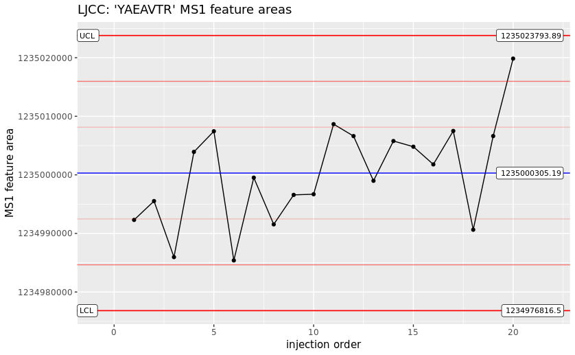

Here, we describe details of a mzQC JSON document used for a QC sample mass spectrometry run. 
For description of the general structure of mzQC, see the Single-Run Example of mzQC.
Find the complete file at the bottom of this document or in the example folder.
The mzQC file is made from the acquision of a QC2 sample as described in [QCloud: A cloud-based quality control system for mass spectrometry-based proteomics laboratories](https://doi.org/10.1371/journal.pone.0189209). 
Optional (detailed) descriptions about the file can be placed into mzQC next to the general information about the file.
```
    "description": "This is an example of an mzQC file produced from a proteomics QC2 sample. 20 ug dried Pierce HeLa protein digest standard from Thermo Fisher Scientific (Part number: 88329) are dissolved in 200 uL of 0.1% formic acid in water to a final concentration of 100 ng/uL. A total amount of 1 uL (100ng) is injected per analysis.",
```
The metrics describe simple values like the cornerstone numbers of the acquisition and identification process, but also information specific to the QC method employed. Here, it is the mass accuracies and MS1 feature areas of selected peptides. With regular runs like this, the instrument's performance can be reliably monitored and maintenance interventions scheduled before valuable samples are wasted on an instrument running at sub-par performance. 
```
               {
                  "accession":"MS:4000078",
                  "name":"QC2 sample mass accuracies",
                  "value":{
                     "MS:1003169":["YAEAVTR","STLTDSLVC(Carbamidomethyl)K","SLADELALVDVLEDK","NPDDITNEEYGEFYK","LAVDEEENADNNTK","FEELNMDLFR","EAALSTALSEK","DDVAQTDLLQIDPNFGSK","RFPGYDSESK","EATTEFSVDAR","EQFLDGDGWTSR"],
                     "MS:4000072":[-0.2346854518740762,-0.08024023890884578,-0.1322012562867409,-0.2259441806378488,-0.10596535779273217,0.28345130855013684,-0.08600783742175504,-0.3683484942567654,-0.03348194493295555,-0.41789282666789496,-0.12794363836212685]
                  }
               },
               {
                  "accession":"MS:4000079",
                  "name":"QC2 sample intensities",
                  "value":{
                     "MS:1003169":["YAEAVTR","STLTDSLVC(Carbamidomethyl)K","SLADELALVDVLEDK","NPDDITNEEYGEFYK","LAVDEEENADNNTK","FEELNMDLFR","EAALSTALSEK","DDVAQTDLLQIDPNFGSK","RFPGYDSESK","EATTEFSVDAR","EQFLDGDGWTSR"],
                     "MS:1001844":[1234940000.0,922790000.0,80819100.0,478714000.0,254935000.0,52841200.0,243597000.0,24581800.0,707504000.0,129063000.0,205583000.0]
                  }
               }
```
The individual peptides' values are stored in a table, that is defined by the respective metric cv term. In case of the feature areas, there is a column indicating the peptide and another column for the respective feature area. 
```
[Term]
id: MS:4000079
name: QC2 sample intensities
def: "Observed intensities for the peptides of a QC2 sample measurement within 5 ppm and +/- 240 s RT tolerance. Different metrics of observed intensities are possible, at least one must be present. The table should contain the peptides as defined in the parent QC2 sample metric term, missing are interpreted as not detected." [PSI:MS]
is_a: MS:4000005 ! table
relationship: has_metric_category MS:4000076 ! QC2 sample metric
relationship: has_metric_category MS:4000008 ! ID based metric
relationship: has_column MS:1003169 ! proforma peptidoform sequence
relationship: has_optional_column MS:1001858 ! XIC area
relationship: has_optional_column MS:1001859 ! normalized XIC area
relationship: has_optional_column MS:1001844 ! MS1 feature area
relationship: has_optional_column MS:1001843 ! MS1 feature maximum intensity
relationship: has_optional_column MS:1003085 ! previous MSn-1 scan precursor intensity
```
Since each column is in turn defined by a cv term, the column can also be assigned an expected value type and unit. In this case the feature area column is expected to contain values of `MS:1001844 - MS1 feature area`s. This concept allows for easier automated metric consumption and even generic plotting of graphs. With a collection consecutive QC2 sample mzQC files, a plot like a Levey-Jennings Control Chart are easily achieved.




### This is the mzQC file once again, in full:
**[QC2-sample-example.mzQC](https://github.com/HUPO-PSI/mzQC/tree/main/specification_documents/draft_v1/examples/QC2-sample-example.mzQC)**