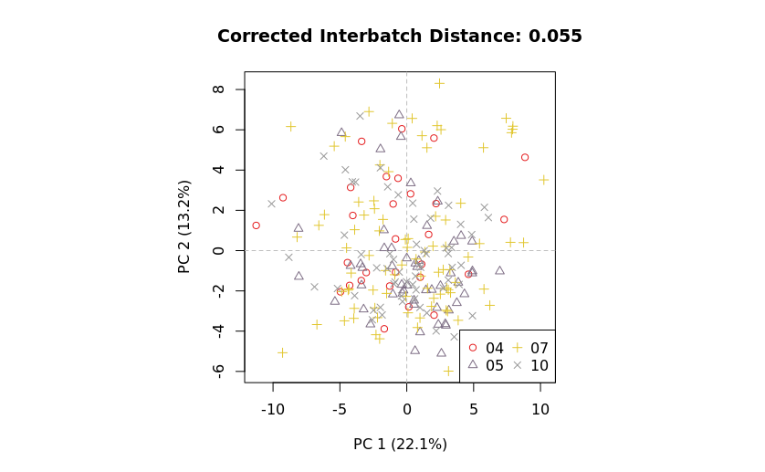

This document demonstrates the use of the mzQC file format for capturing and comparing quality metrics before and after batch correction in a metabolomics study.
The mzQC example provided is based on data from GC-ToF-MS analysis of polar metabolites from an _Arabidopsis_ nucleotype-plasmotype diallel study, as described in [Wehrens et al. (2016)](https://dx.doi.org/10.1007%2Fs11306-016-1015-8).
The full mzQC file is available [here](https://github.com/HUPO-PSI/mzQC/tree/main/specification_documents/examples/example_batch_correction.mzQC).

Batch effects in mass spectrometry data can obscure biological signals and compromise downstream analyses.
This example illustrates how mzQC can store and compare quality metrics for evaluating the impact of batch correction methods.
By leveraging the structured format of mzQC, users can:
- Track the effects of batch correction using quality metrics.
- Easily compare data before and after correction.
- Visualize and analyze metrics for quality assurance.

## Data

The dataset includes 240 GC-ToF-MS runs from the _set3_ data of Wehrens et al. (2016).
We will use the following data files, derived from the `BC.RData` file on the [GitHub repository of the original study](https://github.com/rwehrens/BatchCorrMetabolomics):
- `set3.peakarea.csv`: Unprocessed peak area data.
- `set3.uncorrected.PCA.csv`: Principal component analysis (PCA) results before batch correction.
- `set3.corrected.PCA.csv`: PCA results after batch correction.

Batch correction was performed using the [BatchCorrMetabolomics](https://github.com/rwehrens/BatchCorrMetabolomics) R package, with scripts provided in [`example_batch_correction.R`](example_batch_correction.R).
The corrected PCA results (`set3.corrected.PCA.csv`) capture the batch-adjusted data.

## Quality metrics

The mzQC format can organize data into `runQuality` and `setQuality` sections, with `runQuality` used to store metrics corresponding to individual runs and `setQuality` capturing metrics for collections of runs.
This distinction helps in organizing and analyzing data at both granular and holistic levels.
Quality metrics in mzQC capture data characteristics and processing outcomes.

### Metrics for individual runs

Each run is represented by its own `runQuality`, with metrics specific to that run.
For instance:

```
"runQualities": [
  {
    "metadata": {
      "inputFiles": [
        {
          "location": "file://tmp/GCMS-ToF-sample-10.mzML",
          "name": "GCMS-ToF-sample-10",
          "fileFormat": {
            "accession": "MS:1000584",
            "name": "mzML format"
          },
          "fileProperties": [
            {
              "accession": "MS:1000031",
              "name": "instrument model",
              "value": "GC-ToF-MS (Agilent 6890 GC coupled to a Leco Pegasus III MS)"
            }
          ]
        },
        {
          "location": "file://tmp/GCMS-ToF-sample-10.mztab",
          "name": "GCMS-ToF-sample-10",
          "fileFormat": {
            "accession": "MS:1003389",
            "name": "mzTab-M"
          }
        }
      ],
      ...
      "cvParameters": [
        {
          "accession": "MS:4000103",
          "name": "number of identified quantification data points",
          "description": "The number of identified data points for quantification purposes within the run after user defined acceptance criteria are applied.  These data points may be for example XIC profiles, isotopic pattern areas, or reporter ions (see MS:1001805). The used type should be noted in the metadata or analysis methods section of the recording file for the respective run. In case of multiple acceptance criteria (FDR) available in proteomics, PSM-level FDR should be used for better comparability.",
          "value": "MS:1001844"
        }
      ]
    },
    "qualityMetrics": [
      {
        "accession": "MS:4000103",
        "name": "number of identified quantification data points",
        "description": "The number of identified data points for quantification purposes within the run after user defined acceptance criteria are applied.  These data points may be for example XIC profiles, isotopic pattern areas, or reporter ions (see MS:1001805). The used type should be noted in the metadata or analysis methods section of the recording file for the respective run. In case of multiple acceptance criteria (FDR) available in proteomics, PSM-level FDR should be used for better comparability.",
        "value": 57,
        "unit": {
          "accession": "UO:0000189",
          "name": "count unit"
        }
      }
    ]
  },
]
```

This provides detailed information for each individual run, ensuring granularity in quality control.

Note also the interplay between configuration settings in the `metadata` section and metrics in the `qualityMetrics` section.
The QC metric records the number of identified quantification points, but does not explicitly specify how the quantification information should be calculated.
Hence, this is explicitly specified as the MS1 feature areas (`MS:1001844`) of the detected metabolites using a matching `cvParameter` in the `metadata` section with as value the corresponding controlled vocabulary (CV) accession.

### Analysis of all runs

For multiple runs, metrics are aggregated in the `setQuality` section.
This allows for analysis of batch effects, performance trends, and overall data quality.
For example:

**Before batch correction:**

```
{
  "accession": "MS:4000092",
  "name": "identified MS1 feature area principal component analysis result",
  "description": "A table with the PCA results of identified MS1 feature areas.",
  "value": {
    "MS:4000086": ["GCMS-ToF-sample-10", "GCMS-ToF-sample-100", "GCMS-ToF-sample-101", ...],
    "MS:4000081": [-3.3489633839, 0.4191257477, 6.8241553933, ...],
    "MS:4000082": [-2.3414347017, 2.0552198422, 1.5142354815, ...],
    "MS:4000083": [-1.486755263, -0.3965900879, 1.1636677021, ...],
    "MS:4000084": [-0.2766203768, 1.7808802633, 0.1736233713, ...],
    "MS:4000085": [-2.6836316103, -2.0202377954, -3.0888055462, ...],
    "MS:4000089": [13, 16, 17, ...],
    "MS:4000088": [4, 7, 7, ...]
  }
}
```

**After batch correction:**

```
{
  "accession": "MS:4000094",
  "name": "batch-corrected identified MS1 feature area principal component analysis result",
  "description": "A table with the PCA results of identified MS1 feature areas after batch-correction.",
  "value": {
    "MS:4000086": ["GCMS-ToF-sample-10", "GCMS-ToF-sample-100", "GCMS-ToF-sample-101", ...],
    "MS:4000081": [-0.4378513055, 0.041082478, 5.464116568, ...],
    "MS:4000082": [-1.3379076029, 2.0719734906, 3.1049060343, ...],
    "MS:4000083": [2.4957145183, 2.0074886436, 2.6374608754, ...],
    "MS:4000084": [2.195431331, -1.3532219705, 1.9931159041, ...],
    "MS:4000085": [0.7936133863, -0.1016825037, -0.9434314272, ...],
    "MS:4000089": [13, 16, 17, ...],
    "MS:4000088": [4, 7, 7, ...]
  }
}
```

This specific QC metric is a table metric, with various columns represented by CV terms.
Each column corresponds to a specific aspect of the PCA results, such as the run names (`MS:4000086`), principal component values (`MS:4000081`, `MS:4000082`, en `MS:4000083`), batch labels (`MS:4000088`), or injection sequence labels (`MS:4000089`).

### Comparing metrics

The structured PCA results in mzQC allow side-by-side comparison of metrics before and after batch correction.

before | after
--- | ---
 | 

This facilitates:
- Quantitative assessment of batch correction effectiveness.
- Visualization of improvements via PCA plots.
- Identification of residual batch effects.

This example highlights how mzQC can streamline quality control processes in metabolomics and foster collaboration through standardized and transparent reporting.
