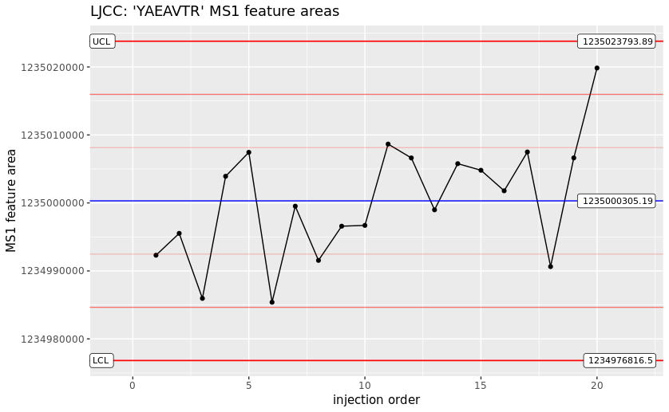

This document outlines the utilization of an mzQC file for quality control (QC) of a mass spectrometry proteomics experiment.
The mzQC file discussed here is derived from a QC2 sample, following protocols established in the publication, [QCloud: A cloud-based quality control system for mass spectrometry-based proteomics laboratories](https://doi.org/10.1371/journal.pone.0189209).
A QC2 sample is defined as a high complexity sample that mimics real samples analyzed in a proteomics laboratory, and is meant to be injected 1–5 times per week as a sample to test system suitability.

Here we demonstrate how real-life QC metrics are calculated for a single mass spectrometry run using tools such as QCloud.
You can view the complete structure of this mzQC example [here](https://github.com/HUPO-PSI/mzQC/tree/main/specification_documents/examples/intro_qc2.mzQC).

## File description

Our mzQC file example provides a detailed description of its contents and purpose, which allows users to understand the context and relevance of the QC metrics:

```json
"description": "This is an example of an mzQC file produced from a proteomics QC2 sample. 20 ug dried Pierce HeLa protein digest standard from Thermo Fisher Scientific (Part number: 88329) are dissolved in 200 uL of 0.1% formic acid in water to a final concentration of 100 ng/uL. A total amount of 1 uL (100ng) is injected per analysis.",
```

## Input files specification

The mzQC file lists necessary input files including both the raw mass spectrometry data file (mzML) and the peptide identification data file (mzIdentML).
The latter is required for deriving ID-based QC metrics later on.

```json
"inputFiles": [
  {
    "location": "file://tmp/QC2_18052020.mzML",
    "name": "QC2_18052020_mzML",
    "fileFormat": {
      "accession": "MS:1000584",
      "name": "mzML format"
    },
    "fileProperties": [
      {
        "accession": "MS:1000747",
        "name": "completion time",
        "value": "2020-05-18 09:20:48"
      },
      {
        "accession": "MS:1000569",
        "name": "SHA-1",
        "value": "fbe692c887404179518089abc670484c"
      },
      {
        "accession": "MS:1000031",
        "name": "instrument model",
        "value": "LTQ Orbitrap Velos"
      }
    ]
  },
  {
    "location": "file://tmp/QC2_18052020.mzid",
    "name": "QC2_18052020_mzId",
    "fileFormat": {
      "accession": "MS:1002073",
      "name": "mzIdentML format"
    }
  }
],
```

## Metrics calculation

First, the mzQC file includes single-value metrics that provide quantifiable data on the MS data acquisition process, such as the number of MS2 spectra, identified spectra, peptides, and proteins:

```json
{
  "accession": "MS:4000060",
  "name": "number of MS2 spectra",
  "description": "The number of MS2 events in the run.",
  "value": 62299,
  "unit": {
    "accession": "UO:0000189",
    "name": "count unit"
  }
},
{
  "accession": "MS:1003251",
  "name": "count of identified spectra",
  "description": "The number of spectra that pass the threshold to be considered identified with sufficient confidence.",
  "value": 24765,
  "unit": {
    "accession": "UO:0000189",
    "name": "count unit"
  }
},
{
  "accession": "MS:1003250",
  "name": "count of identified peptidoforms",
  "description": "The number of peptidoforms that pass the threshold to be considered identified with sufficient confidence.",
  "value": 22241,
  "unit": {
    "accession": "UO:0000189",
    "name": "count unit"
  }
},
{
  "accession": "MS:1002404",
  "name": "count of identified proteins",
  "description": "The number of proteins that have been identified, which must match the number of groups that pass the threshold in the file.",
  "value": "5504",
  "unit": {
    "accession": "UO:0000189",
    "name": "count unit"
  }
},
```

Next, the file includes metrics on precursor mass accuracies and sample intensities for selected peptides from the QC2 sample:

```json
{
  "accession": "MS:4000078",
  "name": "QC2 sample mass accuracies",
  "description": "Observed mass accuracy for the peptides of a QC2 sample measurement. The table should contain the peptides as described in the QC2 sample metric term, missing are interpreted as not detected.",
  "value": {
    "MS:1003169": [
      "YAEAVTR",
      "STLTDSLVC[Carbamidomethyl]K",
      "SLADELALVDVLEDK",
      "NPDDITNEEYGEFYK",
      "LAVDEEENADNNTK",
      "FEELNMDLFR",
      "EAALSTALSEK",
      "DDVAQTDLLQIDPNFGSK",
      "RFPGYDSESK",
      "EATTEFSVDAR",
      "EQFLDGDGWTSR"
    ],
    "MS:4000072": [
      -0.2346854518740762,
      -0.08024023890884578,
      -0.1322012562867409,
      -0.2259441806378488,
      -0.10596535779273217,
      0.28345130855013684,
      -0.08600783742175504,
      -0.3683484942567654,
      -0.03348194493295555,
      -0.41789282666789496,
      -0.12794363836212685
    ]
  }
},
{
  "accession": "MS:4000079",
  "name": "QC2 sample intensities",
  "description": "Observed intensities for the peptides of a QC2 sample measurement within 5 ppm and +/- 240 s RT tolerance. Different metrics of observed intensities are possible, at least one must be present. The table should contain the peptides as defined in the parent QC2 sample metric term, missing are interpreted as not detected.",
  "value": {
    "MS:1003169": [
      "YAEAVTR",
      "STLTDSLVC[Carbamidomethyl]K",
      "SLADELALVDVLEDK",
      "NPDDITNEEYGEFYK",
      "LAVDEEENADNNTK",
      "FEELNMDLFR",
      "EAALSTALSEK",
      "DDVAQTDLLQIDPNFGSK",
      "RFPGYDSESK",
      "EATTEFSVDAR",
      "EQFLDGDGWTSR"
    ],
    "MS:1001844": [
      1234940000,
      922790000,
      80819100,
      478714000,
      254935000,
      52841200,
      243597000,
      24581800,
      707504000,
      129063000,
      205583000
    ]
  }
}
```

These metrics are structured as tables within the mzQC document, with each row representing a peptide and columns detailing the specific metric values.

## Controlled vocabulary definition

All QC metrics in an mzQC file should be backed by a formal definition in a controlled vocabulary (CV) or ontology.
By default, mzQC sources its metrics from the [PSI-MS CV](https://github.com/HUPO-PSI/psi-ms-CV/).
For example, the "QC2 sample intensities" metric is formally defined in the PSI-MS CV as follows:

```
[Term]
id: MS:4000079
name: QC2 sample intensities
def: "Observed intensities for the peptides of a QC2 sample measurement within 5 ppm and +/- 240 s RT tolerance. Different metrics of observed intensities are possible, at least one must be present. The table should contain the peptides as defined in the parent QC2 sample metric term, missing are interpreted as not detected." [PSI:MS]
is_a: MS:4000005 ! table
relationship: has_metric_category MS:4000076 ! QC2 sample metric
relationship: has_metric_category MS:4000008 ! ID based metric
relationship: has_column MS:1003169 ! proforma peptidoform sequence
relationship: has_optional_column MS:1001858 ! XIC area
relationship: has_optional_column MS:1001859 ! normalized XIC area
relationship: has_optional_column MS:1001844 ! MS1 feature area
relationship: has_optional_column MS:1001843 ! MS1 feature maximum intensity
relationship: has_optional_column MS:1003085 ! previous MSn-1 scan precursor intensity
```

This CV term is structured to capture multiple aspects of peptide detection and quantification, which include:

- [ProForma](https://github.com/HUPO-PSI/ProForma) peptidoform sequence: Mandatory column denoting the peptides that were detected.
- Abundance measurements: Various optional columns can be used to record the peptide abundances using different strategies. Typically only one of those optional columns will be present.

The example above records the peptide intensities based on the MS1 feature areas. Thus, the second column for the metric has name `MS:1001844`, corresponding to the definition of this metric.

## Visualization and data analysis

The structured data in mzQC allows for effective visualization and analysis, such as plotting trends across multiple peptides, samples, or experiments.
This can help identify any deviations or potential issues with the mass spectrometry process, prompting timely maintenance and calibration actions to maintain optimal performance.
For example, Levey-Jennings charts can be used to enable quick visual assessment of instrument stability or drift, critical for high-stakes or high-throughput proteomics workflows:



This example demonstrates how QC information in mzQC files helps in monitoring instrument performance, ensuring that maintenance is proactive and timely, thereby preserving the integrity and effectiveness of subsequent analyses.
