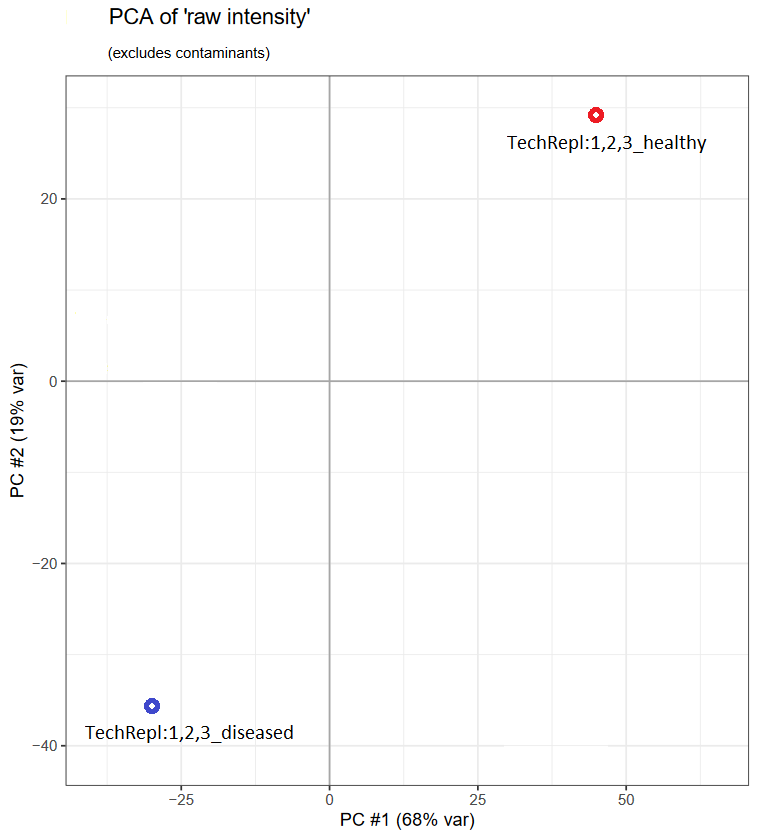

In mzQC, collections of mass spectrometry runs are grouped into what are termed "sets."
This builds upon our understanding of [using mzQC for individual runs](https://hupo-psi.github.io/mzQC/examples/intro_run/), extending it to how you can analyze and represent data from multiple runs together.
Think of a "set" as a bundle of runs that you want to examine collectively, such as technical and biological replicates.

> [!TIP]
> Sets are versatile!
> You can group runs together, but you can also group sets within other sets.
> This allows for a structured hierarchy in your analysis, like grouping technical replicates under biological ones and then comparing across conditions.

Discover the full example of an mzQC file for a set [here](https://github.com/HUPO-PSI/mzQC/tree/main/specification_documents/examples/intro_set.mzQC).

The structure of an mzQC file for a set mirrors that for a single run, starting with the root element `mzQC`:

```
{
  "mzQC": {
    ...
  }
}
```

Within `mzQC`, there are three main sections:

1. **General file information:** These attributes provide essential details about the mzQC file itself.

```
"version": "1.0.0",
"creationDate": "2020-12-01T14:19:09Z",
"contactName": "Chris Bielow",
"contactAddress": "chris.bielow@bsc.fu-berlin.de",
"description": "A simple mzQC file containing information for a set of multiple mass spectrometry runs.",
```

2. **Controlled vocabulary (CV) references:** This section points to standardized vocabularies used to ensure consistent metric definitions across files.
It is typically included at the end of the mzQC file.

```
"controlledVocabularies": [
  {
    "name": "Proteomics Standards Initiative Mass Spectrometry Ontology",
    "uri": "https://github.com/HUPO-PSI/psi-ms-CV/releases/download/v4.1.144/psi-ms.obo",
    "version": "4.1.144"
  }
]
```

3. **Quality metrics for the set:** This core part of the file captures the QC metrics specific to the set being described.

```
"setQualities": [
  {
    ...
  }
]
```

Each element within `setQualities` defines a distinct set, enabling the comparison of, say, different experimental conditions or replicate groups.

A set's QC data is contextual—it makes sense within the bounds of the group.
For instance, it wouldn't be right to lump individual run metrics like MS1 scan counts for several runs into a single set metric; those belong to individual run analyses.
Instead, set metrics reflect the collective characteristics of all runs within the set, offering insights into the overall experimental quality.

Imagine you have several technical replicates from an experiment with two conditions, and you're interested in grouping these by technical replicates.
You might end up with sets for "healthy" and "diseased" conditions, plus a combined "all" set for overarching analyses.
As an example, we'll use three different groupings:

1. The "healthy" set, consisting of technical replicates "techRep1_healthy", "techRep2_healthy", "techRep3_healthy".
2. The "diseased" set, consisting of technical replicates "techRep1_diseased", "techRep2_diseased", "techRep3_diseased".
3. The "all" set, combining both the "healthy" and "diseased" set.

These labels are important, acting as tags for each set, guiding your analysis.
Therefore, it is recommended to use a descriptive label, for example based on the experimental design or the kind of comparisons you want to make.

```
"metadata": {
  "label": "healthy",
  "inputFiles": [
    ...
  ]
},
"qualityMetrics": [
  ...
]
```

`inputFiles` lists the specific files contributing to a set, with all the technical details neatly described using CV terms.

```
"inputFiles": [
  {
    "name": "techRep1_healthy",
    "location": "file://C:/msdata/techRep1_healthy.mzML",
    ...
  },
  {
    "name": "techRep2_healthy",
    "location": "file://C:/msdata/techRep2_healthy.mzML",
    ...
  },
  {
    "name": "techRep3_healthy",
    "location": "file://C:/msdata/techRep3_healthy.mzML",
    ...
  }
],
```

Let's dive into an example metric, like the "contaminant protein abundance ratio."
This metric quantifies the abundance arising from known contaminant proteins (like keratins from skin or BSA from sample buffers) compared to the total abundance across all proteins in the sample.
High levels of contaminants can indicate issues with sample preparation or handling, leading to potential biases in the data analysis.

```
{
  "metadata": {
    "label": "healthy",
    ...
  },
  "qualityMetrics": [
    {
      "accession": "MS:4000177",
      "name": "contaminant protein abundance ratio",
      "description": "The ratio of total protein abundance in a mass spectrometry run or a group of runs which can be attributed to a user-defined list of contaminant proteins (e.g. using the cRAP contaminant database).",
      "value": 0.25,
      "unit": {
        "accession": "UO:0010006",
        "name": "ratio"
      }
    }
  ]
},
{
  "metadata": {
    "label": "diseased",
    ...
  },
  "qualityMetrics": [
    {
      "accession": "MS:4000177",
      "name": "contaminant protein abundance ratio",
      "description": "The ratio of total protein abundance in a mass spectrometry run or a group of runs which can be attributed to a user-defined list of contaminant proteins (e.g. using the cRAP contaminant database).",
      "value": 0.31,
      "unit": {
        "accession": "UO:0010006",
        "name": "ratio"
      }
    }
  ]
}
```

While this metric can be calculated for each run individually, here we have aggregated that information across both the "healthy" and "diseased" sets instead.

For our second example, we'll use the "all" set that combines the previous "healthy" and "diseased" sets.
To compare protein abundances between healthy and diseased states, we might look at a PCA (principal component analysis).
mzQC can store PCA results, capturing the variation between these two states.

For this we extracted protein abundances from the `proteinGroups.txt` file specified as an input file to the "all" set.
This file is produced by MaxQuant and contains quantified protein intensities along with other identification information for each protein group detected in the experiment.

First, let's have a look at what the PCA plot would look like, plotting the first two principal components:



Next, we'll look at how mzQC can encapsulate such analysis, storing the the first five principal components as a table metric, referenced by the previously defined set labels.

```
{
  "accession": "MS:4000090",
  "name": "principal component analysis of MaxQuant's protein group raw intensities",
  "description": "A table with the PCA results of MaxQuant's protein group raw intensities.",
  "value": {
    "MS:4000086": [
      "healthy",
      "diseased"
    ],
    "MS:4000081": [
      47.2,
      -30.2
    ],
    "MS:4000082": [
      29.1,
      -36.5
    ],
    "MS:4000083": [
      3.8,
      -7.3
    ],
    "MS:4000084": [
      -7.7,
      5.6
    ],
    "MS:4000085": [
      140.6,
      -64.1
    ]
  }
}
```

Note how the principal components are represented as columns in a table, with each column defined by a CV term.
Additionally, the label is represented by CV term `MS:4000086`, in this case referring to the previous "healthy" and "diseased" sets.
This label can refer to any input files or metadata labels defined in the same mzQC file.
Consequently, we could also have performed the PCA analysis on each input file separately, in which cases the labels would have been the names of the individual input files ("techRep1_healthy", "techRep2_healthy", ..., "techRep3_diseased").
Thus, the table metric can have a flexible number of rows, based on the input of this set and the grouping level used.

> [!WARNING]
> It would not have been valid to perform a PCA on only the three healthy samples or only the three diseased samples.
> As mentioned previously, QC metrics in sets need to relate to _all_ elements in the set, and the current set includes both the healthy and diseased subsets.
