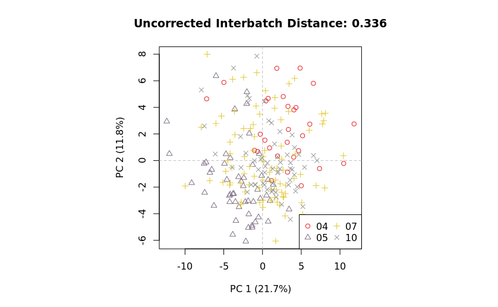
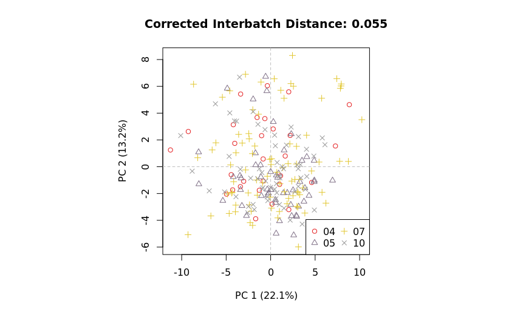

Here, we describe details of a metabolomics mzQC JSON document used to describe a Studies' quality before and after batch correction methods are applied. 
For description of the general structure of mzQC, see the Single-Run Example of mzQC.
Find the complete file at the bottom of this document or in the example folder.
The mzQC file is made from the acquisions of GC-ToF-MS polar metabolite data of an Arabidopsis nucleotype-plasmotype diallel study as described in [Improved batch correction in untargeted MS-based metabolomics](https://dx.doi.org/10.1007%2Fs11306-016-1015-8) by Wehrens, et al.(2016). 

```
"description": "This is a metabolomics batch-correction use-case study for mzQC using the method described in 'Improved batch correction in untargeted MS-based metabolomics' by Wehrens, et al.(2016) [https://doi.org/10.1007%2Fs11306-016-1015-8]. The data comes from set3 of the supplementary material.",
```
## Data
This example has 240 runs, for which each a `qualityMetric` object is present in `qualityMetrics`, for sake of brevity only containing the number of successfully identified primary metabolites.
The data is taken from *set3* of the publication only, extracted from `BC.RData` and stored as `set3.peakarea.csv` and `set3.uncorrected.PCA.csv` (same data).
All data from [Wehrens, et al.(2016) can be found on GitHub](https://github.com/rwehrens/BatchCorrMetabolomics).
## Batch correction
Batch correction was applied as described in the supplementary with BatchCorrMetabolomics (see github repo) scripted in [`demo_set3only.R`](demo_set3only.R). Output is `set3.corrected.PCA.csv`.
## mzQC
From the above information and data, we can formulate a mzQC file.
```
{
  "metadata": {
    "inputFiles": [
      {
        "location": "file://tmp/GCMS-ToF-sample-10.mzML",
        "name": "GCMS-ToF-sample-10",
        "fileFormat": {
          "accession": "MS:1000584",
          "name": "mzML format"
        },
        "fileProperties": [
          {
            "accession": "MS:1000031",
            "name": "instrument model",
            "value": "GC-ToF-MS (Agilent 6890 GC coupled to a Leco Pegasus III MS)"
          }
        ]
      },
      {
        "location": "file://tmp/GCMS-ToF-sample-10.mztab",
        "name": "GCMS-ToF-sample-10",
        "fileFormat": {
          "accession": "MS:1003389",
          "name": "mzTab-M"
        }
      }
    ],
    "analysisSoftware": [
      {
        "accession": "MS:1001058",
        "name": "quality estimation by manual validation",
        "description": "The quality estimation was done manually.",
        "version": "0",
        "uri": "https://dx.doi.org/10.1021/pr201071t"
      },
      {
        "accession": "MS:1000799",
        "name": "custom unreleased software tool",
        "description": "A software tool that has not yet been released. The value should describe the software. Please do not use this term for publicly available software - contact the PSI-MS working group in order to have another CV term added.",
        "value": "mzqc-pylib",
        "version": "0",
        "uri": "https://hupo-psi.github.io/mzQC/unknown.html"
      }
    ]
  },
...
```
To be able to estimate the effect of the batch correction, we first describe all runs that are batch corrected by a principal component analysis of their peak area features. Hence, we use a `setQuality` composed of all involved `inputFiles`, and add related metrics in the qualityMetric section.
```
{
  "accession":"MS:4000092",
  "name":"identified MS1 feature area principal component analysis result",
  "description":"A table with the PCA results of identified MS1 feature areas.",
  "value":{
    "MS:4000086":["GCMS-ToF-sample-10","GCMS-ToF-sample-100","GCMS-ToF-sample-101", ...],
    "MS:4000081":[-3.3489633839,0.4191257477,6.8241553933, ...],
    "MS:4000082":[-2.3414347017,2.0552198422,1.5142354815, ...],
    "MS:4000083":[-1.486755263,-0.3965900879,1.1636677021, ...],
    "MS:4000084":[-0.2766203768,1.7808802633,0.1736233713, ...],
    "MS:4000085":[-2.6836316103,-2.0202377954,-3.0888055462, ...],
    "MS:4000089":[13,16, ...],
    "MS:4000088":[4,7,7, ...]
  }
},
```
The metric describes the results of a PCA in the form of a table. Each contributing run is named in the `Run name` column ("MS:4000086"), at least two dimensions of PC are to be reported in the next columns, here five ("MS:4000081"-"MS:4000085"), and for better visualisations and evaluation, `Batch label`("MS:4000089") and `Injection sequence number` ("MS:4000088") columns provide additional annotations to the included runs.
After batch correction, we create another PCA.
```
{
  "accession": "MS:4000094",
  "name": "batch-corrected identified MS1 feature area principal component analysis result",
  "description": "A table with the PCA results of identified MS1 feature areas after batch-correction.",
  "value": {
    "MS:4000086": ["GCMS-ToF-sample-10", "GCMS-ToF-sample-100", "GCMS-ToF-sample-101", ...],
    "MS:4000081": [-0.4378513055, 0.041082478, 5.464116568, ...],
    "MS:4000082": [-1.3379076029,2.0719734906,3.1049060343,...],
    "MS:4000083": [2.4957145183,2.0074886436,2.6374608754,...],
    "MS:4000084": [2.195431331,-1.3532219705,1.9931159041,...],
    "MS:4000085": [0.7936133863,-0.1016825037,-0.9434314272,...],
    "MS:4000089": [13,16,17,...],
    "MS:4000088": [4,7,7,...]
  }
}
```
With a corresponding metric after batch correction methods are applied, a side-by-side comparison of the batch correction results can be easily achieved.

before | after
---    |   ---
 | 


### This is the mzQC file once again, in full:
**[metabo-batches.mzQC](https://github.com/HUPO-PSI/mzQC/tree/main/specification_documents/examples/metabo-batches.mzQC)**
