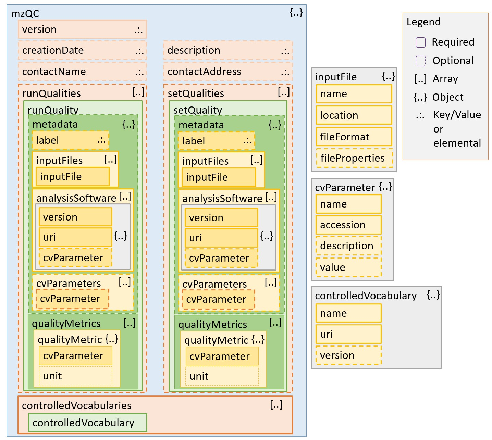

# mzQC JSON Schema

For a detailed description of the mzQC Schema, please see the [mzQC Specification Document](https://docs.google.com/document/d/132F3MBgDJgtFlXxDZhpJ1oHGbKL8pT6dk9fvL55L5_M/edit?usp=sharing).

## Changelog

### Version 1.0.0 (Jun 2021)

- Add `contactName` and `contactAddress` to store contact information of the mzQC file creator.
- Add `label` to name the mzQC file.
- Remove free text `fileProvenance` from `metadata`.

### Version 0.1.1 (Nov 2020)

- Removed `cvRef` from `qualityMetric`s.
- Made `creationDate` attribute of the root `mzQC` element mandatory.
- Moved `unit` from `cvParameter` to `qualityMetric`.
- Relax the restrictions on the format of `accession` strings.

### Version 0.1.0 (Aug 2019)

- Added optional `creationDate` to root `mzQC` element.
- Renamed `cv` to `controlledVocabularies`.
- Renamed `qualityParameters` to `qualityMetrics`.
- Added optional `fileProvenance` to the `metadata`.
- Added optional additional `cvParameters` to the `metadata`.
- Internalised the `cvRef` which also acted as name of the JSON object in the `controlledVocabularies` list as attribute into the now dynamic object.
