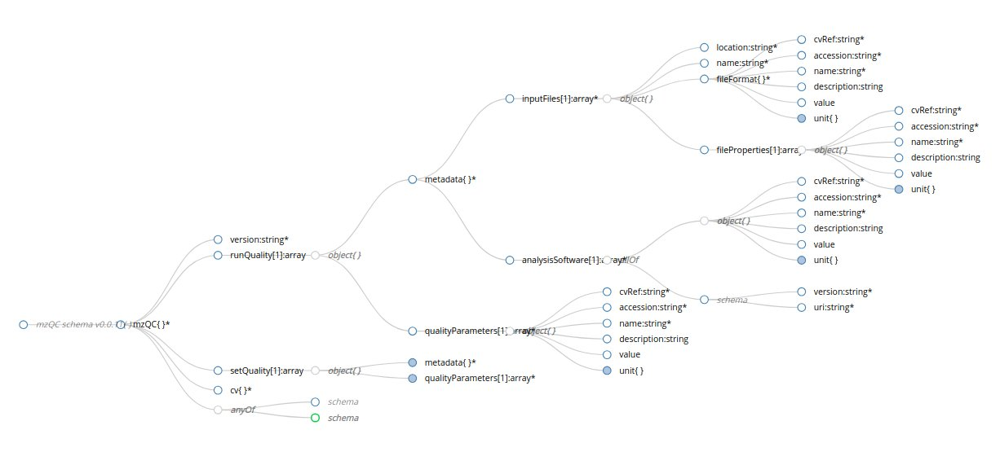

# mzQC Schema

Please find the _current_ schema, documentation and examples in the `current` folder (which should link to the highest version number folder.
Version number increase usually indicates non-minor schema changes.

### Developers:
each version folder should contain:
* example folder
* README.md with some documentation
* a schema visualisation file
* the schema file

In case of version bump, make sure to:
1. symlink the schema file to schema.json in the folder
2. symlink the schema visualisation to schema.jpg in the folder
3. update the current folder symlink to the folder
4. update the links in the README.md of the schema root folder
